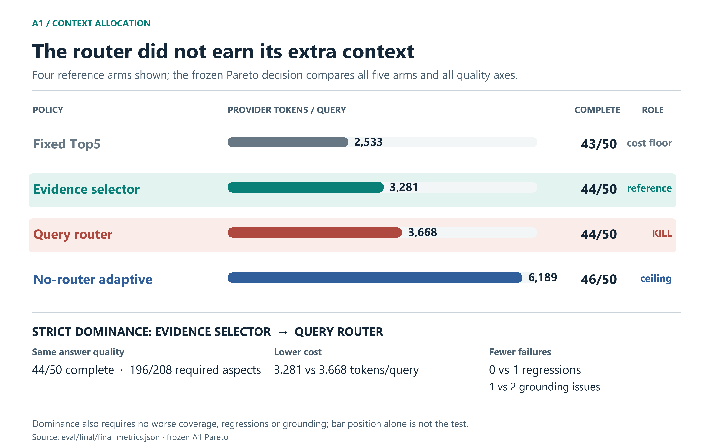
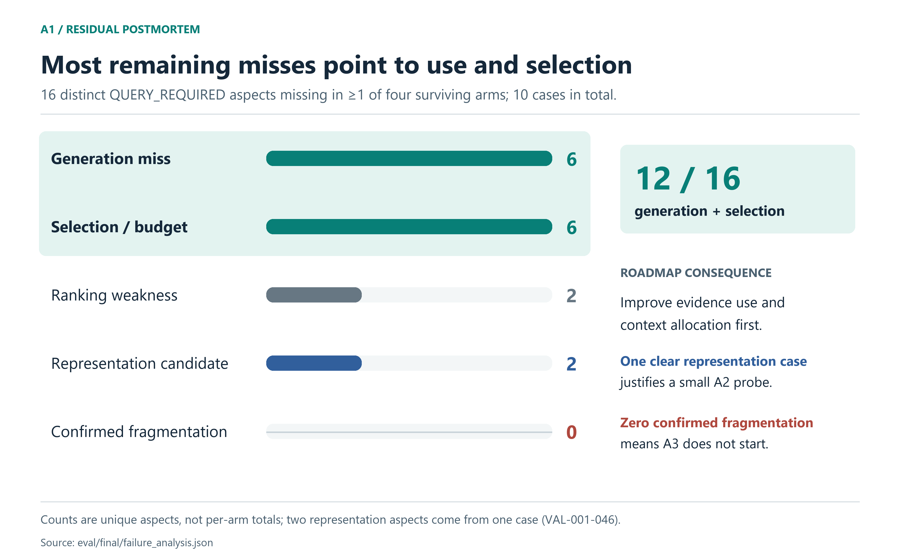
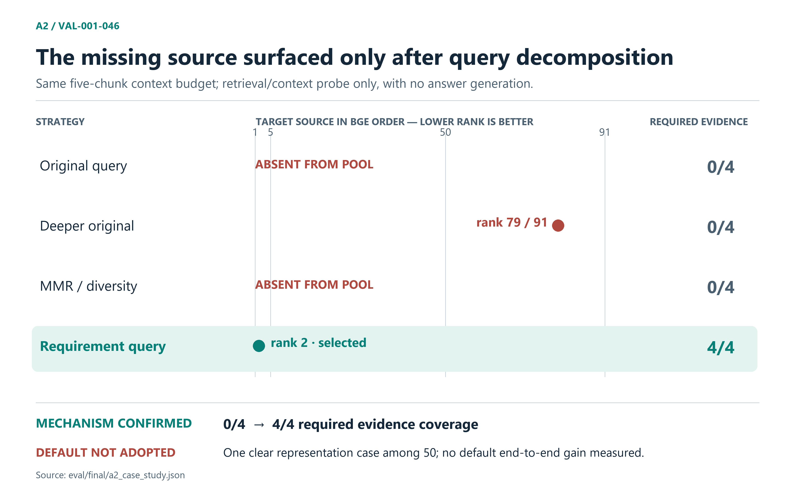

# GitHub Policy Support Agent

A source-grounded Q&A agent over GitHub's [`github/site-policy`](https://github.com/github/site-policy) corpus. It combines lexical and semantic retrieval, cross-encoder reranking, a small evidence context, grounded answer generation, and deterministic citation validation. When the available evidence cannot support an answer, it says so.

Broad policy questions invite an obvious response: retrieve deeper, show the model more text, and route complex queries through more elaborate paths. This project followed that intuition far enough to test it. The evidence pointed to a smaller system.

**Decision snapshot**

- **Keep:** hybrid retrieval and BGE reranking as the research recommendation.
- **Use by default in research:** a fixed Top5 evidence context; it is the cheapest non-dominated A1 arm.
- **Remove:** this frozen SIMPLE/BROAD router, which a selector without query classification strictly dominated.
- **Hold:** requirement decomposition repaired one clear failure, but did not earn a default runtime path.
- **Do not start:** hierarchical retrieval had no confirmed fragmentation failure to target.

The repository's executable default is still **MiniLM + fixed Top5**. **BGE + fixed Top5 is the research-selected recommendation, not a production change in this repository.**

## The evidence was mostly already there

The first suspicion was candidate recall: perhaps a broad question misses an exception because retrieval never finds its source. On the 50-case Validation V1 set, however, the lexical Top20 + semantic Top20 candidate union contained support for **235 of 239** original rubric facts (**98.3%**); **49 of 50** cases had every required fact in the union. That is a *candidate availability* diagnostic, not an answer score. It made indiscriminate retrieval expansion a weak next bet. The more promising bottlenecks were where evidence landed in the ranking, how much reached the prompt, and whether the answer used it. [Candidate geometry](eval/results/evidence_geometry_summary.md)

Holding the candidate union fixed, BGE moved original-rubric fact coverage at Top5 from **211 to 224** versus MiniLM. An end-to-end transfer check under the earlier answer rubric then improved answer macro **0.866 → 0.920** and answer-complete cases **36 → 38**. Those completeness counts are not directly comparable with the later Human Truth A1 counts. The transfer included individual losses, but the aggregate answer gain justified using BGE as the *shared research baseline* for the next question. [Reranker A/B](eval/results/reranker_ab_summary.md) · [Answer transfer](eval/results/reranker_transfer_summary.md)

## If selection is the bottleneck, should the query set the budget?

There was a reason to ask. On a 16-case **development** set of broad queries, fixed Top5 supplied complete core evidence for 7 cases; an adaptive prefix did so for 15, while an evidence-side selector did so for 11. This suggested that some questions needed more context, but it did not establish that a query router would improve final answers. [Broad V3 context comparison](eval/results/broad_v3_coverage_selector_eval.json)

A frozen SIMPLE/BROAD rule therefore tested whether *query structure* should decide the context budget: SIMPLE received fixed Top5; BROAD received adaptive prefix. The comparison also included `coverage_selector_v2`, which allocates evidence without a query-class label, and a no-router adaptive quality ceiling. All A1 arms shared the BGE candidate order, generation prompt, and 50-case set. The Stage 0 replay fixed the rule and context policies before answer evaluation. [Router rule](eval/query_aware_router_v1.json) · [Frozen arms](eval/query_aware_arms_v1.json) · [Stage 0 freeze](eval/query_aware_stage0_freeze.md)

One measurement correction mattered before judging those answers. The original 239 facts describe source-supported policy content; a related fact is not always something the user asked to know. Independent review classified which aspects were **QUERY_REQUIRED**. The A1 primary answer denominator became **208 user-required aspects** on Validation V1. Thus 235/239 candidate availability and 196/208 A1 answer coverage answer different questions. [Human Truth rule](eval/human_truth_contract_v1.md) · [Frozen verdicts](eval/results/frozen_human_verdicts_v1.json)

Context replay gave a warning: selector and router both put **195/208** required aspects into selected context and made **47/50** contexts complete, while the router used more evidence tokens. Context can still be present and unused, so the decision waited for generated answers. The study evaluated **156 unique answers blind to arm and cost**, resolved the review queue, froze quality, and only then joined per-arm provider-token economics. [Context replay](eval/results/human_aware_context_v1_summary.md) · [Blind quality freeze](eval/results/a1_blind_answer_quality_frozen_summary.md) · [Final Pareto](eval/results/a1_final_pareto_v1.json)



[Vector version](eval/final/figures/router_decision.svg)

The decisive pair was `coverage_selector_v2` versus `query_router_v1`: both covered **196/208** required aspects and completed **44/50** answers. The selector used **3,281** versus **3,668** provider tokens/query, with **0 versus 1** confirmed complete-answer regressions and **1 versus 2** correctness/grounding issues. Under the frozen multi-metric rule, the selector **strictly dominated** the router. That verdict applies to this rule, benchmark, and model setup; it is not a universal claim about routing.

The selector was still not a clean default replacement. Against fixed Top5, it gained one required aspect and lost another, while using about **29.5%** more tokens. Fixed Top5 remained the simplest cost extreme (**2,533** tokens/query, **43/50** complete, zero confirmed regressions). No-router adaptive reached **46/50** complete and **202/208** covered, but used **6,189** tokens/query (about **2.44×** fixed) and had one regression. These are real frontier trade-offs, not a single composite score. [A1 decision](eval/results/a1_final_decision_v1.md)

## The remaining misses chose the next experiment

After rejecting the router, aggregate quality still could not say which mechanism to try. A case-by-case postmortem examined **16 distinct QUERY_REQUIRED aspects** missing in at least one of the four surviving arms, across **10 cases**. It checked candidate presence, BGE order, selected context, and answer use. [Failure postmortem](eval/results/a1_failure_analysis_summary.md)



[Vector version](eval/final/figures/failure_roadmap.svg)

**Six** misses occurred despite evidence being in context; **six** were selection/budget misses. Two reflected weak ranking. The final **two aspects shared one clear representation case**. There were **zero confirmed fragmentation cases**. That distribution made decomposition worth a *small mechanism probe* on the exceptional case, while giving hierarchical or parent expansion no observed trigger. Early geometry diagnostics had flagged possible structural shapes; the later query-required, answer-level review did not confirm fragmentation as the cause of a residual miss.

### One case where decomposition really worked

`VAL-001-046` asks whether GitHub notifies someone before disclosing account data to investigators **and** when notice may be withheld or delayed. The supporting section for the missed requirements was absent from the original-query candidate union. A fixed-budget retrieval probe compared ways to expose it; the requirement queries were derived from the user's question, not from the policy answer. [Frozen requirements](eval/a2_minimal_probe_requirements_v1.json) · [Probe result](eval/results/a2_minimal_mechanism_probe_summary.md)



[Vector version](eval/final/figures/decomposition_case.svg)

Deeper original-query retrieval found the source only at **BGE rank 79 of 91**. MMR could not choose a source absent from its pool. Requirement-query retrieval moved it to **rank 2**, selected it in the same five-chunk budget, and changed *required evidence coverage* from **0/4 to 4/4**. This is a retrieval/context mechanism proof, **not a newly generated answer-quality result**.

The clear representation failure appeared in **1/50** cases. That is enough to establish the mechanism for this case, but not enough to put a decomposition call on every query. Decomposition remains a dormant research option awaiting stronger incidence and net-benefit evidence. Parent/hierarchical retrieval was **not tested**: with zero confirmed fragmentation failures, its precondition was not met. [A2 case](eval/final/a2_case_study.json) · [Final architecture decision](eval/final/architecture_decision.md)

## What runs, and what the research recommends

The common pipeline is deliberately short:

```text
query → multi-turn rewrite when needed
      → lexical Top20 + semantic Top20 → union / chunk-ID dedup
      → cross-encoder rerank → fixed Top5 evidence
      → grounded generation → deterministic citation/output validation
```

`PolicySupportAgent.from_project()` currently constructs the **MiniLM** cross-encoder. The research recommendation substitutes **BGE** at that reranking step, keeping fixed Top5. The study did not change the production default or add router, decomposition, or hierarchical branches. The evidence-side selector and no-router adaptive policy remain reference alternatives, not the selected default. [Current code](src/agent.py) · [Reranker default](src/reranker.py)

## Run the agent

Python 3.12+, a local copy of the policy corpus, model downloads on first indexing, and an OpenAI-compatible Chat Completions endpoint are required.

```powershell
git clone --depth 1 https://github.com/github/site-policy.git data/site-policy
python -m venv .venv
.\.venv\Scripts\python.exe -m pip install -r requirements.txt
Copy-Item .env.example .env  # set LLM_API_KEY, LLM_BASE_URL, LLM_MODEL
.\.venv\Scripts\python.exe -m src.indexing
.\.venv\Scripts\python.exe -m src.semantic_indexing --device cpu
.\.venv\Scripts\python.exe -m src.cli
```

Use `python -m src.cli --debug` to inspect the rewritten query, selected evidence, and budget after setup. The high-level Python entry point is `PolicySupportAgent.from_project(device="cpu").answer(question, history=[])`.

## Evidence and limits

The A1 answer comparison used frozen Human Truth, blinded answer labels, review of disputed judgments, and quality frozen before economics. Provider total tokens/query is the primary cost measure; USD figures in the research files are uncached-equivalent estimates. [Metrics](eval/final/final_metrics.json) · [Reproducibility manifest and hashes](eval/final/reproducibility_manifest.md) · [Research summary](eval/final/research_summary.md)

The findings concern this GitHub policy snapshot, 50 Validation V1 queries, the frozen SIMPLE/BROAD rule, these context policies, and this model/retrieval setup. Validation V1 began untouched but was later inspected and used for diagnostics; this is not a fresh external generalization test. The 16-case Broad V3 set was development data. Citation validation checks IDs and source metadata, not semantic support for every claim. The A2 probe did not generate answers; no default decomposition benefit was measured. The agent offers source-grounded policy explanation, not legal advice.

The result is a small runtime backed by explicit decisions about where complexity helped, where it lost, and where the evidence was too thin to add it.
