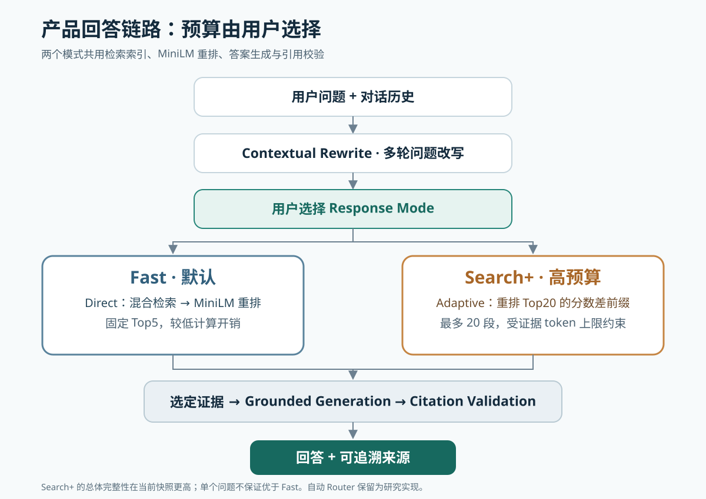
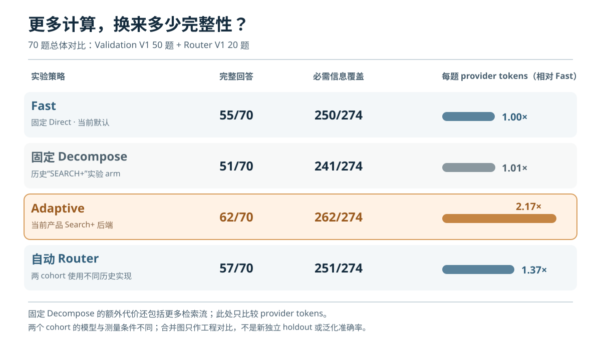

# GitHub Policy Support Agent

基于 [GitHub site-policy](https://github.com/github/site-policy) **57 篇政策文档**的可追溯问答系统。政策术语与用户表述可能不同，多轮追问会省略上下文，完整回答还需要条件、例外和来源。项目先建立可靠的检索与引用链路，再用实验决定什么时候值得投入更多计算。

## 最终体验：Fast / Search+

**Fast**：默认模式，使用稳定的 Direct pipeline 和固定 Top5 证据，优先较低计算开销与稳定响应。**Search+**：用户选择的高预算模式，当前后端是 **Adaptive**；它在同一次混合检索与重排得到的 Top20 中，从 Top5 起逐段扩展，遇到与第一名重排分数差超过 **3.0** 或下一段会使证据超过 **6,000 tokens** 时停止，最多选 20 段。Adaptive 不做 query 难度分类，也不调用 Decomposer。

在当前 70 题对比快照中，Adaptive 的总体答案完整性高于 Fast，平均 provider tokens 约为 Fast 的 **2.17 倍**。这是两个研究数据集上的总体观察，**不保证每一道题的 Search+ 回答都更好**。两种模式共享对话历史；切换只改变本轮证据预算，重启后回到 Fast。



## 从可靠 baseline 到预算选择

### 先让系统能找、能答、能引用

主链路是 **Contextual Rewrite → hybrid retrieval（lexical Top20 + semantic Top20）→ 按 chunk 去重 → MiniLM cross-encoder reranking → 证据选择 → grounded generation → citation validation**。Fast 固定使用 Top5；证据不足时，回答应说明已发布政策没有给出所问细节。[主链路](src/agent.py) · [检索与重排](src/reranked_retriever.py) · [生成与引用校验](src/generator.py)

Validation V1 的 50 题诊断中，原始 rubric facts 的候选覆盖达到 **235/239**；Fast 所依据的 fixed Top5 冻结答案完成 **43/50** 题、覆盖 **196/208** 个必需信息点。239 是来源事实的诊断分母，208 是裁决后的 `QUERY_REQUIRED` 信息点分母，不能把两项直接相减成准确率漏斗。[候选诊断](eval/results/evidence_geometry_summary.md) · [冻结答案评测](eval/results/a1_blind_answer_quality_frozen_summary.md) · [裁决口径](eval/human_truth_contract_v1.md)

多轮追问先利用近期 history 改写成独立问题，再进入同一检索链路。BGE 在离线对照中改善了排序，但同输入 CPU warm rerank p95 为 **14.78 秒**，MiniLM 为 **2.55 秒**，且存在完整答案回归；因此运行默认仍采用 MiniLM。[重排运行决策](eval/reports/runtime_reranker_decision_v1.md)

### 更深的检索是否值得？

baseline 已能找到大多数相关候选，但有些完整答案仍缺信息。接下来的问题是：能否让系统自己判断，什么时候值得多花一些计算？我最初尤其期待找到一个足够可靠的自动 Router：需要更深检索时自动升级，否则维持 Fast。这个假设有吸引力，因为它有机会兼顾低预算路径的效率、高预算路径的答案收益，同时不要求用户每次作选择。项目随后比较固定 Direct、固定拆分、扩大证据前缀，以及自动选择执行路径，检验额外检索与上下文预算究竟能换来多少收益。

几轮对照让这个问题变得不那么简单：更深的检索有时补到缺失证据，有时只增加冗余，有时新证据还会挤掉已有的有效证据；Auto Router 的总体增益也不足以说明它已经可靠找到了值得升级的题目。现实没有形成一条可直接采用的“复杂 query → 更复杂 pipeline”规则。下面的聚合结果决定工程取舍，后面的具体案例则帮助解释这些不同结果如何产生。

**Fixed Decompose** 是始终调用 Decomposer、进行多流检索并固定合并证据的实验路径。**Auto Router** 是实验中自动选择执行路径的策略；两个数据集使用不同的历史 Router 实现，它不是一套统一的线上算法，也不在普通 CLI 中运行。旧 70 题记录曾把 Fixed Decompose 命名为“SEARCH+”；**当前产品 Search+ 已映射为 Adaptive**，下表据此改用“Fixed Decompose”避免混淆。[完整对比与来源](eval/reports/zh/multiarm_70_summary_zh.md)

## 70 题多策略对比

下表将 Validation V1 的 50 题与 Router V1 的 20 题合并作**工程对比一览**，不是新的独立 holdout，也不是泛化准确率。两 cohort 的历史实现与评测来源不同：Validation 复用了 BGE、无改写的 A1 结果，Router 20 使用 MiniLM 与共享改写；必需信息真值也分别来自人工裁决与模型审查。因而合并数只用于观察当前证据下的质量与成本取舍。[比较口径](eval/reports/zh/multiarm_70_summary_zh.md)

| 实验策略 | 完整回答 | 必需信息覆盖 | Provider tokens/题 | 相对 Fast |
|---|---:|---:|---:|---:|
| Fast / Fixed Direct | 55/70 | 250/274（91.2%） | 2,452.6 | 1.00× |
| Fixed Decompose | 51/70 | 241/274（88.0%） | 2,470.7 | 1.01× |
| **Adaptive（当前 Search+ 后端）** | **62/70** | **262/274（95.6%）** | **5,322.1** | **2.17×** |
| Auto Router | 57/70 | 251/274（91.6%） | 3,371.9 | 1.37× |



Fast 是成本端点；Adaptive 在当前快照中提供更高的总体完整性，但花费两倍以上 provider tokens。Fixed Decompose 虽然 token 数接近 Fast，还会增加检索流与重排开销。Auto Router 比 Fast 多完成 **2/70** 题，却增加 token 成本，也没有捕捉到足够多的逐题最佳策略机会。历史 latency 的覆盖和测量条件不同，主表不把它们合并比较。四种策略若**事后逐题选择最佳**，可达 **64/70**、**265/274**；这是 post-hoc empirical upper bound，**不是产品成绩**。

读到这里，需要作出的不只是“哪个算法最好”的判断。用户有时只想尽快得到可靠的政策说明，有时愿意投入更多计算，争取更完整的证据和回答。即使面对同一个 query，这两种选择也可能都合理；预算选择不完全是 query 的属性，用户愿意付出的时间和计算预算不能仅凭 query wording 可靠推断。

Router 应在什么条件下替用户升级预算，一直困扰着我。到目前为止，我仍没有得到一个自己认为足够可靠、又能证明额外复杂度值得的自动解法。这并不意味着自动选择没有研究空间；只是当前数据和实现还不足以支持把它放进用户主链路。继续优化 Router、decomposition 和 evidence selection 可以留给下一阶段，而当前版本选择在这里收住复杂度。

因此最终将预算偏好显式交还给用户：默认 Fast，需要更高预算时选择 Search+。它们是两种计算预算选择，不是“简单问题 / 困难问题”的标签。自动 Router 仍保留为研究实现与复现材料。[Router V1 报告](eval/reports/zh/router_v1_report_zh.md) · [A1 决策](eval/results/a1_final_decision_v1.md)

## 一个帮助解释机制的案例

聚合对比支持了上面的产品取舍；具体案例用来解释这些策略为何呈现不同结果。证据诊断显示，固定拆分产生的 **31** 个新 chunks 中，只有 **2** 个增加了此前未覆盖的必需信息支持，有时新证据还会挤掉有用的基础证据。[V1.1 诊断](eval/reports/zh/router_v1_1_report_zh.md)

另一方面，`VAL-001-046` 的离线机制验证中，针对缺失条件的 requirement query 将目标来源排到第 **2** 名，使五段上下文内的必需证据覆盖从 **0/4** 到 **4/4**。这展示了更换检索表示可能有效，但当时**没有重新生成答案**，也不能仅凭一个案例决定产品架构；最终决策依据上面的聚合对比。[失败复盘](eval/results/a1_failure_analysis_summary.md) · [A2 机制验证](eval/results/a2_minimal_mechanism_probe_summary.md)


## 快速开始

需要 Python 3.12+、本地政策语料和兼容 OpenAI Chat Completions 的服务端点。首次建索引会下载本地模型。复制 `.env.example` 后在本地填写 `LLM_API_KEY`、`LLM_BASE_URL`、`LLM_MODEL`；不要提交 `.env`。

```powershell
git clone --depth 1 https://github.com/github/site-policy.git data/site-policy
python -m venv .venv
.\.venv\Scripts\python.exe -m pip install -r requirements.txt
Copy-Item .env.example .env
.\.venv\Scripts\python.exe -m src.indexing
.\.venv\Scripts\python.exe -m src.semantic_indexing --device cpu
.\.venv\Scripts\python.exe -m src.cli
```

```text
GitHub Policy Support Agent
Response mode:
  [f] Fast     Standard retrieval, lower compute
  [s] Search+  Higher-budget retrieval, prioritizes completeness
Press Enter for Fast.
Mode [f]:             ← 直接回车
[FAST] > GitHub 收到版权投诉后会怎样处理？
[FAST] > /s
Mode switched to SEARCH+.
[SEARCH+] > 那么申诉流程呢？
```

启动输入 `f`/`F` 或回车为 Fast，`s`/`S` 为 Search+。切换不清除历史；Adaptive 证据选择失败时会回退到 Direct 并给出简短提示。使用 `--debug` 可查看改写、证据数与回退原因。

| 命令 | 作用 |
|---|---|
| `/f` | 切换 Fast |
| `/s` | 切换 Search+ |
| `/mode` | 查看当前模式 |
| `/help` | 查看命令 |
| `/exit`、`exit`、`quit` | 退出 |

## 项目结构、评测与复现

```text
src/                  主链路、CLI、Adaptive 产品适配层及保留的 Router 研究代码
tests/                主链路与研究路径测试
eval/                 benchmark、truth、预注册、实验脚本与复现记录
eval/results/         冻结结果、原始输出与 70 题对比摘要
eval/reports/         研究总结与图表
data/site-policy/     单独获取的上游文档（本地，不提交）
cache/                本地索引、模型与缓存（不提交）
```

```powershell
.\.venv\Scripts\python.exe -m unittest discover -s tests
```

Grounding 依靠证据约束生成，citation validation 确定性地检查引用 ID 和来源元数据；结构合法不等于每个论断都得到语义支持。详细 benchmark、truth、实验记录与复现材料在 [eval/](eval/README.md)，包括 [研究架构记录](eval/reports/research_v1/architecture_decision.md) 与 [复现清单](eval/reports/research_v1/reproducibility_manifest.md)。

## 限制与下一步

Validation V1 和 Broad V3 已作为开发数据使用，不是新外部 holdout；70 题合并快照也有跨 cohort 实现与 judge 来源差异。答案 judge 的小样本校准由单一项目作者最终裁决，不能当作全面独立人工真值。[校准报告](eval/reports/judge_calibration_v1.md)

目前未验证真实用户问题分布、部署监控或在线反馈。Search+ 在本地 MiniLM 栈上的实际体验仍应独立观察；当前快照不保证逐题优于 Fast。本项目提供有来源的政策说明，不提供法律意见。
