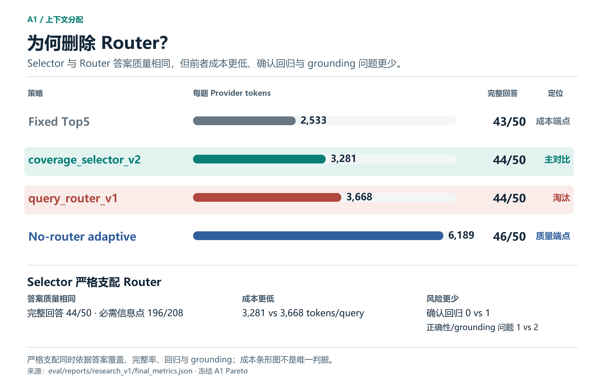
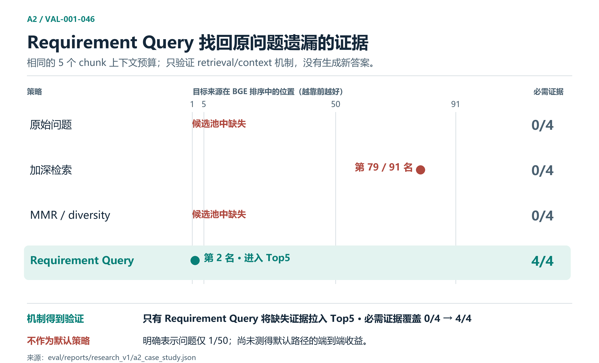

# 研究摘要：Query-Aware Retrieval

约 3–5 分钟可读完。仅使用冻结结果；没有新实验或合成评分。

## 1. 问题

这个 Agent 基于本地 `github/site-policy` 语料回答政策问题。宽泛问题可能同时要求多个条件、例外、主体和流程事实，因此相关性高的证据未必**完整**。研究要回答的是：哪些额外机制有足够证据值得进入系统？

## 2. Baseline

实验前冻结的确定性 pipeline：

```text
multi-turn rewrite → Lexical Top20 + Semantic Top20 → union/dedup → BGE reranker
→ fixed Top5 context → grounded generation → deterministic citation validation
```

Validation V1 包含 50 道宽泛问题。早期 239 个来源/rubric facts 用于 retrieval 与 ranking 诊断；208 个 `QUERY_REQUIRED` aspects 用于 context 与 answer 评测。**Frozen Adjudicated Labels V1** 的初评由两个独立 model agents 完成（V1/V3 共 314/331 初始一致），另 17 条由项目作者在 A1 质量分析前人工裁决。历史 `human_truth` 文件名为复现而保留；模型间一致不是人类标注者一致，239 与 208 的指标也不是同一条 accuracy funnel。

## 3. 瓶颈诊断

Candidate retrieval 已接近饱和：候选 required-fact coverage 约为 **98.3%（235/239）**。普遍扩大检索的收益空间有限；更紧的约束在于 **context allocation 和 answer utilization**。

## 4. A1：Query routing 是否有帮助？

假设：SIMPLE/BROAD 问题结构可以指导 context budget。

| 策略 | 覆盖必需信息 | 完整题 | 确认回归 | Tokens/query |
|---|---:|---:|---:|---:|
| `fixed_top5` | 196/208 | 43/50 | 0 | 2,533 |
| `coverage_selector_v2` | 196/208 | 44/50 | 0 | 3,281 |
| `query_router_v1` | 196/208 | 44/50 | 1 | 3,668 |
| `no_router_adaptive_v1` | 202/208 | 46/50 | 1 | 6,189 |

`coverage_selector_v2` 与 router 的必需信息覆盖和整题完成数相同，成本更低、回归更少。Router 被**严格支配**，结论为 **KILL**。没有继续调参；这个负面结果就是正式的 A1 结果。



## 5. A2：Decomposition 在何处有效

假设：复合问题的单一表述可能压低其中一项要求的证据可见性。对 `VAL-001-046` 的最小离线机制验证如下：

| 策略 | 证据可见性 | 覆盖 |
|---|---|---|
| 原问题 | 缺失 | 0/4 |
| 加深原问题检索 | 排名 79/91 | 0/4 |
| MMR / diversity | 不在候选池 | 0/4 |
| Requirement query | 排名 2 | 4/4 |

只有 decomposition 恢复了缺失证据；加深检索与 MMR 都未做到。但明确的 representation failure 仅见于 **1/50** 题，因此它**未成为默认机制**，仅作为按证据触发的研究选项保留。



## 6. A3 决策

Parent/hierarchical retrieval **未测试**：剩余失败复盘中有 **0 个确认的 chunk-fragmentation case**，没有观察到值得启动该实验的失败模式。状态为 `A3_NOT_TRIGGERED`。

## 7. 最终架构

Hybrid retrieval → BGE reranker → `fixed_top5` context → grounded generation → deterministic validation 描述的是**研究推荐配置**。后续[配对 runtime 决策](../runtime_reranker_decision_v1.md)保留了 MiniLM + `fixed_top5` 作为可执行默认值：在配对的历史 208-aspect 评价协议下，BGE 的离线汇总收益伴随 4 题完整答案回归，warm CPU rerank p95 则是 MiniLM 的 5.80 倍。早期 239-fact 答案结果（完整题 36 → 38）不能与后来 208-aspect blind evaluation（43/50）连成累计提升曲线。相较候选机制集合，最终结果更简单：一项已验证机制保留，一项被 KILL，一项确认但未启用，一项未达到触发条件。

Validation V1 早期有 holdout 价值，后来已用于 geometry、reranker、架构、失败与机制研究。历史冻结比较在各自协议内仍有参考价值；不能在这份已经暴露的 development / research benchmark 上同时选择和验证新架构。

## 8. 工程启示

- 加机制前先定位瓶颈；candidate recall 已接近饱和。
- 机制对某个案例有效，不代表发生率足以支持默认启用。
- 移除被支配的组件，并记录负面结果。
- **只有测得的失败模式能支持增加复杂度时，才增加复杂度。**

详见 `architecture_decision.md`、`final_metrics.json`、`failure_analysis.json`、`a2_case_study.json`、`figures/`。

## Release 收尾：Non-Oracle Controller Gate

检索、预算与失败分析之后，最后检验了一个部署信息可得的动作发现问题：只给问题、实际上下文和草稿，能否可靠提出一次必要补充或补证据动作？冻结 BGE 研究场景的 12 个输入各执行两次；PATCH 0/2、REFRESH 0/3 稳定发现，单次提出的 REFRESH 未复现。没有 transport/parse failures，controls 和 optional-pressure 没有有害触发，但自然正例没有稳定可执行动作。

Sensor 额外消耗平均 2,775.8 provider tokens/request；美元成本只按历史 blended rate 估算。**两分支 FAIL → STOP**，没有执行 action probes、E2E 或实现 Controller。产品保留 Fast + Search+，架构研究封板。结果范围、原始报告和 release 澄清见 [Final Controller Gate V1](../final_controller_gate_v1/README.md)；不据此声称 LLM 无法发现缺口或所有 Agent architecture 无效。
